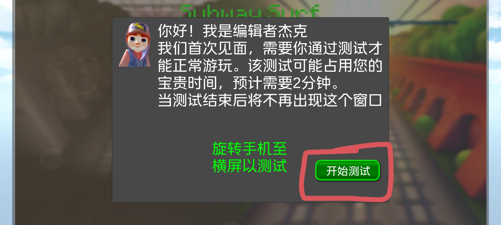
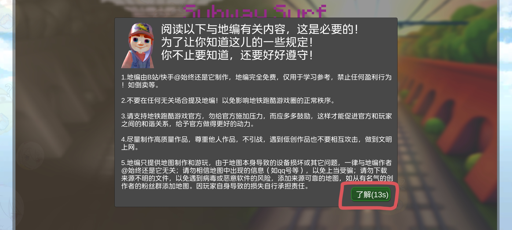
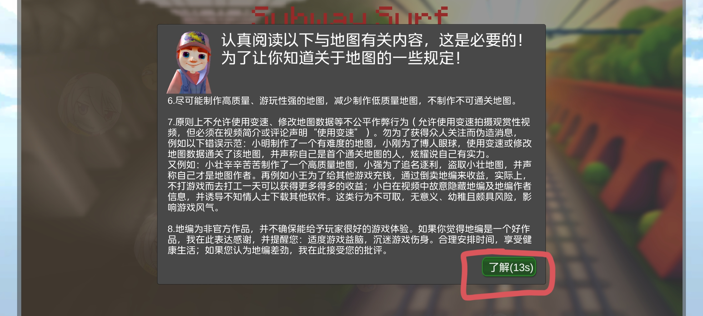
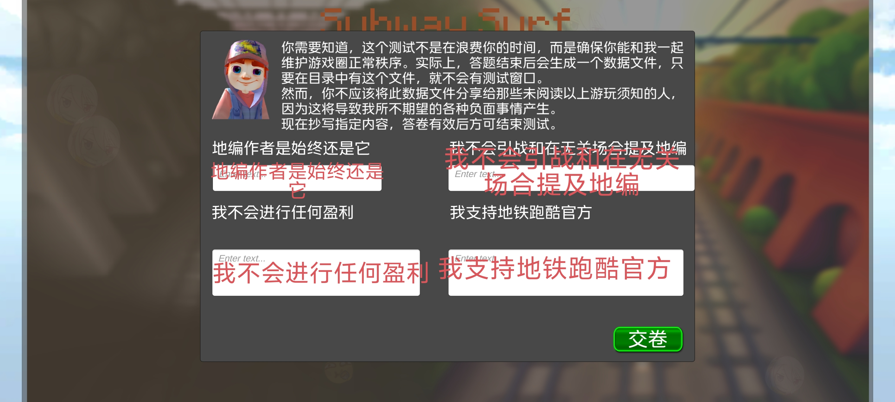
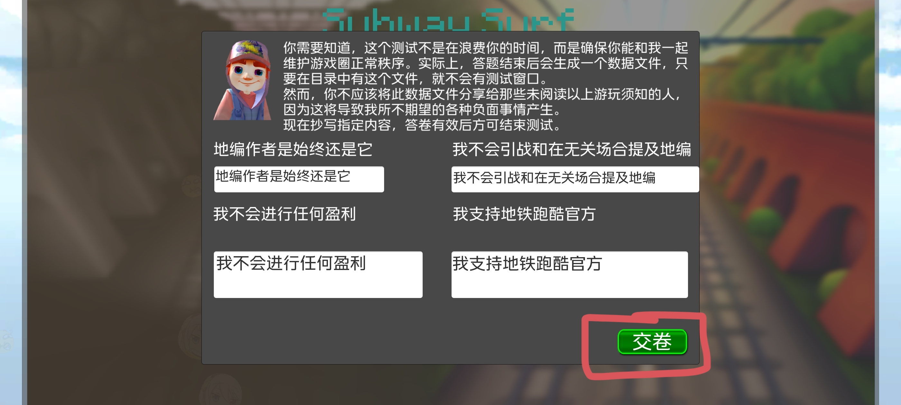

# Subway-Surf-Difficult-version
Original link:https://www.123pan.com/s/y1P0jv-nS1Cd.html
提取码：Szhs                      
可用链接：https://drive.google.com/file/d/17GSAwgpuZygQYfPmOytXzuHuPPoxbq38/view?usp=drivesdk
How to start using                
tutorial（Click on the circled area）        
one

two（Here, waiting time is required）

three

four             
Input horizontally and sequentially in the input box:地编作者是始终还是它，我不会引战和在无关场合提及地编，我不会进行任何盈利，我支持地铁跑酷官方。

five

six

seven              
Go back to https://github.com/
Download level            
Import the level into the corresponding directory            
windows：C:/users/Your Name/AppData/LocalLow/Szhst/Subway Surf Editor/EditorMaps
Android：/storage/emulated/0/Android/data/com.Szhst.SubwaySurfEditor/files/EditorMaps/               
Import the level into this directory

